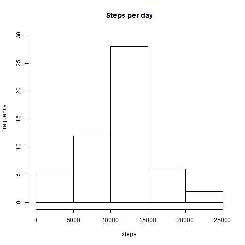
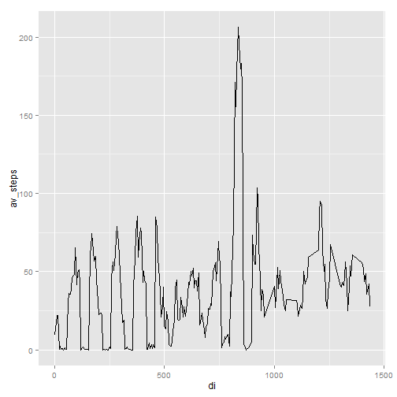
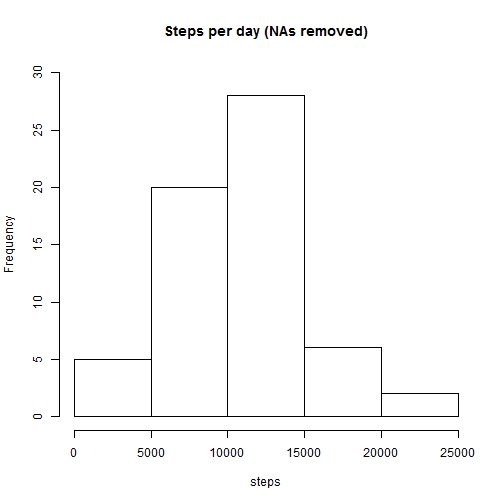
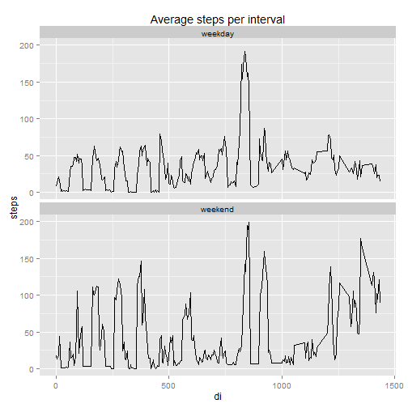

## Loading and preprocessing the data

Here we read in the file activity.csv from the current directory


```r
t <- read.csv("activity.csv")
nrow(t)
```

```
## [1] 17568
```

```r
# we add a column containing the interval within the day, where a
# day has 24*60 minutes
di <- t$interval %% (24*60)
t <- cbind(t, di)
```


## What is mean total number of steps taken per day?


```r
# remove NAs, as per instructions
x <- na.omit(t)

# calculate total steps per day
dt <- aggregate(steps ~ date, sum, data=x)

# histogram of # of steps
hist(dt$steps, main="Steps per day", ylim=c(0,30), xlab ="steps")
```

 

```r
# calculate mean and median steps per day

mn <- mean(dt$steps) 
md <- median(dt$steps) 
```

Mean steps per day is 10766.19 and median is 10765.


## What is the average daily activity pattern?


```r
library(ggplot2)

v <- aggregate(steps ~ di, mean, data=t)
names(v)[names(v)=="steps"] <- "av_steps"
ggplot(v, aes(x=di, y=av_steps)) + geom_line()
```

 

```r
ms <- v[which.max(v$av_steps),]
ms
```

```
##      di av_steps
## 168 835 206.1698
```

The interval with the highest average steps is 835

## Imputing missing values


```r
tna <- t[which(is.na(t$steps)),]
nrow(tna)
```

```
## [1] 2304
```

```r
# here we fill in missing steps values using the average for that
# interval across all days. We do this by merging our previous data
# frame of average steps per interval based using di (daily interval)
# as the key
b <- merge(t, v, by = "di", all.x=TRUE)
b$steps[is.na(b$steps)] <- b$av_steps
```

```
## Warning in b$steps[is.na(b$steps)] <- b$av_steps: number of items to
## replace is not a multiple of replacement length
```

```r
# repeate earlier calculations using this dataset with no NAs

dt_nona <- aggregate(steps ~ date, sum, data=b)
hist(dt_nona$steps, main="Steps per day (NAs removed)", ylim=c(0,30), xlab ="steps")
```

 

```r
mn_nona <- mean(dt_nona$steps) 
md_nona <- median(dt_nona$steps)

mn_diff <- mn_nona - mn
md_diff <- md_nona - md
```

Mean steps per day (with NAs replaced) is 10212.94 and median is 10395.00. These values differ by -553.2533251 and -370 respecively versus the values calculated earlier before NAs were replaced.


## Are there differences in activity patterns between weekdays and weekends?


```r
# first add date columns, including column indicating weekend or weekday. Note that wd_num = 1 for Mondays.

datetime <- strptime(factor(b$date),  format = "%Y-%m-%d")
wd_num <- as.POSIXlt(b$date)$wday
b <- cbind(b, datetime)
b <- cbind(b, wd_num)
b$daytype[b$wd_num <= 5] <- "weekday"
b$daytype[b$wd_num >= 6] <- "weekend"
b$daytype <- factor(b$daytype)


y <- aggregate(steps ~ di + daytype, mean, data=b)
ggplot(y, aes(x=di, y=steps)) + geom_line() +
  facet_wrap(~ daytype, ncol = 1) +
  labs(title = "Average steps per interval")
```

 


